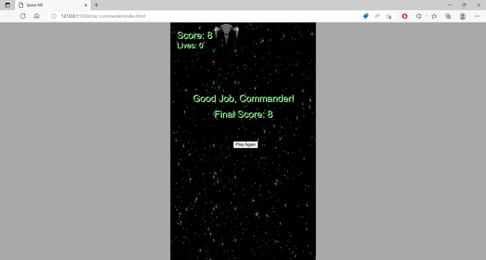

# star-commander

An arcade style game where you are a pilot in charge of defending earth from incoming asteroids. Shoot them all down and save the planet!

## Features

- Intuitive gameplay: Control your spaceship and shoot asteroids with ease.
- Thrilling action: Defend the earth from an endless barrage of incoming asteroids.

## Screenshot

## Installation

1. Clone the repository: `git clone https://github.com/RockyDesigne/star-commander.git`
2. Navigate to the project directory: `cd star-commander`
3. Open the index.html file in your preferred web browser to start playing.

## How to play

Use the arrow keys to move and 'ENTER' to shoot.
